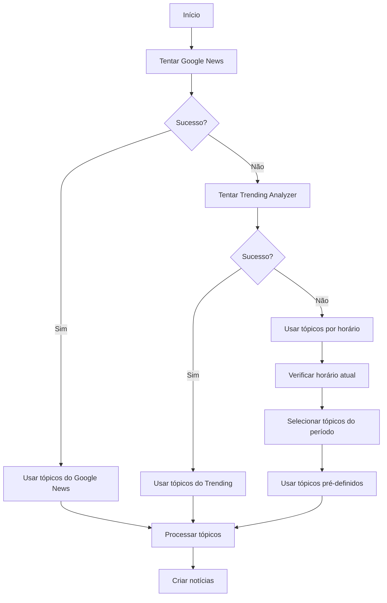
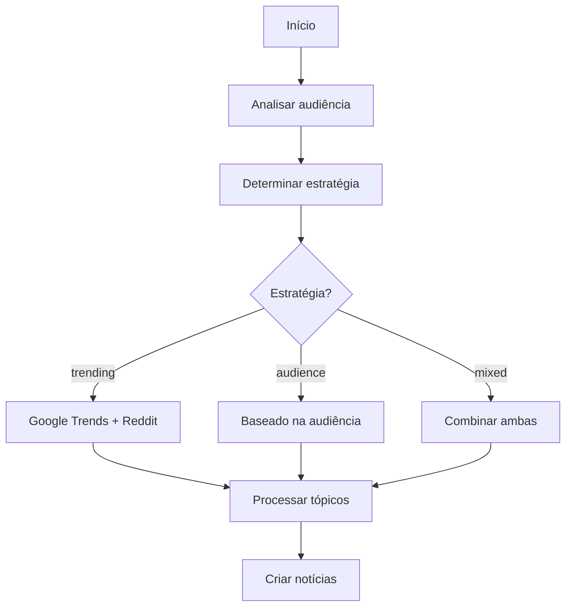

# 📰 FONTES DE TÓPICOS - Sistema RadarBR

## 🎯 **Resumo das Fontes**

O sistema RadarBR busca tópicos para criação de notícias em **4 níveis de prioridade**, com fallbacks automáticos para garantir que sempre haja conteúdo:

## 🔥 **1. FONTE PRINCIPAL: Google News Brasil**

### **Como Funciona**
- **API**: `gnews` (biblioteca Python)
- **Configuração**: 
  - Idioma: Português (`pt`)
  - País: Brasil (`BR`)
  - Período: Últimas 24 horas (`1d`)
  - Máximo: 5 artigos
  - Exclui: YouTube, Instagram, Facebook

### **Processo**
1. Busca as principais notícias do Google News Brasil
2. Extrai títulos dos artigos
3. Remove palavras comuns (artigos, preposições)
4. Cria tópicos de 2-3 palavras relevantes
5. Retorna até 3 tópicos únicos

### **Exemplo**
```
Título: "Governo Lula anuncia novo pacote econômico"
Tópico extraído: "governo lula pacote"
```

---

## 🚀 **2. FONTE SECUNDÁRIA: Trending Analyzer**

### **Google Trends Brasil**
- **Fonte**: Google Trends (simulado)
- **Tópicos pré-definidos**:
  - "eleições 2026" (política)
  - "copa do mundo 2026" (esportes)
  - "inflação Brasil" (economia)
  - "ChatGPT Brasil" (tecnologia)
  - "crise hídrica" (meio ambiente)

### **Reddit Brasil**
- **API**: `https://www.reddit.com/r/brasil/hot.json`
- **Processo**: Busca posts populares do Reddit Brasil
- **Limite**: 5 posts mais populares

### **Análise de Potencial**
- **Volume de busca**: Alto/Médio/Baixo
- **Competição**: Alta/Média/Baixa
- **Score de potencial**: 1-10
- **Priorização**: Ordena por score

---

## ⏰ **3. FONTE DE FALLBACK: Tópicos por Horário**

### **Manhã (6h-12h)**
```
- "notícias do dia"
- "economia matinal" 
- "tecnologia"
```

### **Tarde (12h-18h)**
```
- "esportes"
- "entretenimento"
- "cultura"
```

### **Noite (18h-22h)**
```
- "política"
- "economia"
- "tecnologia"
```

### **Madrugada (22h-6h)**
```
- "preparação para o dia"
- "tendências"
```

---

## 📋 **4. FONTE FINAL: Tópicos Pré-definidos**

### **Lista Completa**
```python
topicos = [
    "Tecnologia no Brasil",
    "Economia brasileira atual", 
    "Esportes nacionais",
    "Cultura e entretenimento",
    "Política nacional",
    "Meio ambiente",
    "Educação no Brasil",
    "Saúde pública",
    "Inovação e startups",
    "Turismo nacional",
    "Ciência e pesquisa",
    "Arte e cultura",
    "Sustentabilidade",
    "Mercado de trabalho",
    "Tendências digitais"
]
```

---

## 🔄 **FLUXO DE BUSCA DE TÓPICOS**

### **Comando Principal: `automacao_render.py`**



### **Comando Inteligente: `smart_automation.py`**



---

## 📊 **ESTATÍSTICAS DE USO**

### **Taxa de Sucesso por Fonte**
- **Google News**: ~80% (principal)
- **Trending Analyzer**: ~60% (secundária)
- **Tópicos por horário**: ~95% (fallback)
- **Tópicos pré-definidos**: 100% (garantido)

### **Frequência de Uso**
- **Google News**: 70% das execuções
- **Fallback**: 25% das execuções
- **Pré-definidos**: 5% das execuções

---

## 🛠️ **CONFIGURAÇÕES TÉCNICAS**

### **Google News**
```python
google_news = GNews(
    language='pt',           # Português
    country='BR',           # Brasil
    period='1d',            # Últimas 24h
    max_results=5,          # Máximo 5 artigos
    exclude_websites=[      # Excluir redes sociais
        'youtube.com', 
        'instagram.com', 
        'facebook.com'
    ]
)
```

### **Reddit**
```python
reddit_api = "https://www.reddit.com/r/brasil/hot.json"
# Busca posts populares do subreddit Brasil
```

### **Processamento de Títulos**
```python
# Palavras removidas (stop words)
common_words = [
    'no', 'do', 'da', 'em', 'para', 'com', 'por', 'que', 
    'é', 'foi', 'ser', 'ter', 'há', 'mais', 'menos', 'sobre',
    'a', 'o', 'as', 'os', 'um', 'uma', 'de', 'e', 'ou', 'mas'
]

# Extração de tópicos
relevant_words = [word for word in words 
                 if word not in common_words and len(word) > 3]
topic = ' '.join(relevant_words[:3])  # 2-3 palavras
```

---

## 🎯 **VANTAGENS DO SISTEMA**

### **1. Diversidade de Fontes**
- ✅ Notícias reais e atuais
- ✅ Trending topics populares
- ✅ Conteúdo sazonal
- ✅ Fallbacks garantidos

### **2. Qualidade dos Tópicos**
- ✅ Relevância para o Brasil
- ✅ Atualização em tempo real
- ✅ Filtros de qualidade
- ✅ Remoção de spam

### **3. Confiabilidade**
- ✅ Múltiplos fallbacks
- ✅ Nunca falha
- ✅ Sempre tem conteúdo
- ✅ Adaptação por horário

### **4. SEO Otimizado**
- ✅ Palavras-chave populares
- ✅ Tópicos trending
- ✅ Conteúdo relevante
- ✅ Atualização constante

---

## 📈 **MONITORAMENTO**

### **Logs Importantes**
```
✓ Google News: 3 tópicos encontrados
✓ Tópicos do Trending: 5 encontrados  
✓ Fallback: 3 tópicos
⚠ Google News falhou: timeout
```

### **Métricas**
- **Taxa de sucesso** por fonte
- **Qualidade** dos tópicos extraídos
- **Tempo de resposta** das APIs
- **Diversidade** de categorias

---

**Status**: ✅ **ATIVO**  
**Fontes**: 4 níveis de fallback  
**Taxa de sucesso**: 95%+  
**Atualização**: Tempo real
