# Fluxo de Criação de Conteúdo - RadarBR

## Diagrama do Processo Completo

```mermaid
flowchart TD
    A[Início: Tópico/Assunto] --> B{Busca no Google News}
    B --> C[Extrai primeiro resultado]
    C --> D[Acessa URL do Google News]
    D --> E[Resolve redirecionamentos HTTP]
    E --> F[Extrai URL original da notícia]
    F --> G{URL original válida?}
    
    G -->|Sim| H[Acessa site original da notícia]
    G -->|Não| I[Usa dados do Google News]
    
    H --> J[Extrai conteúdo do artigo original]
    J --> K{Conteúdo suficiente?}
    K -->|Sim| L[Usa artigo original como base]
    K -->|Não| M[Fallback: Google News]
    
    I --> M
    M --> N[Usa título e descrição do Google News]
    
    L --> O[Gera título SEO único]
    N --> O
    O --> P[Estrutura: Entidade + Verbo + Objeto: Gancho]
    
    P --> Q[Gera conteúdo com IA]
    Q --> R[Baseado no artigo encontrado]
    R --> S[Margem ±15% de palavras]
    S --> T[Reescrita original para SEO]
    
    T --> U[Analisa conteúdo gerado]
    U --> V[Categorização inteligente]
    V --> W[SmartCategorizer]
    W --> X{Categoria existe?}
    X -->|Sim| Y[Usa categoria existente]
    X -->|Não| Z[Cria nova categoria]
    
    Y --> AA[Busca imagem]
    Z --> AA
    AA --> BB{Imagem do artigo original?}
    BB -->|Sim| CC[Extrai imagem com créditos]
    BB -->|Não| DD[Busca em bancos gratuitos]
    DD --> EE[Unsplash/Pexels]
    
    CC --> FF[Detecta vídeos YouTube]
    EE --> FF
    FF --> GG{Vídeo no original?}
    GG -->|Sim| HH[Extrai e incorpora vídeo]
    GG -->|Não| II[Sem vídeo]
    
    HH --> JJ[Publica artigo]
    II --> JJ
    JJ --> KK[Gera slug único]
    KK --> LL[Salva no banco de dados]
    LL --> MM[Ping sitemap]
    MM --> NN[Fim: Artigo publicado]
    
    style A fill:#e1f5fe
    style NN fill:#c8e6c9
    style O fill:#fff3e0
    style Q fill:#f3e5f5
    style V fill:#e8f5e8
    style AA fill:#fce4ec
```



## Detalhamento das Etapas

### 1. **Busca e Extração de Fonte**
- **Entrada**: Tópico/assunto
- **Processo**: Google News → Primeiro resultado → URL original
- **Fallback**: Dados do Google News se URL original inválida

### 2. **Geração de Título SEO**
- **Estrutura**: Entidade + Verbo + Objeto: Gancho
- **Base**: Título original da notícia
- **Otimização**: Evita repetições, foca em SEO

### 3. **Criação de Conteúdo**
- **Base**: Artigo original encontrado
- **IA**: Reescrita original para evitar plágio
- **Margem**: ±15% do número de palavras do original
- **Foco**: SEO e linguagem natural

### 4. **Categorização Inteligente**
- **Análise**: Conteúdo gerado completo
- **Sistema**: SmartCategorizer com padrões semânticos
- **Fallback**: Criação automática de categoria

### 5. **Recursos Multimídia**
- **Imagens**: Prioriza original → Bancos gratuitos
- **Vídeos**: Detecta e incorpora YouTube se presente no original
- **Créditos**: Sempre atribui fontes

### 6. **Publicação Final**
- **Slug**: URL amigável única
- **Banco**: Salva com metadados completos
- **SEO**: Ping automático para sitemaps

## Comandos Disponíveis

### Manual
```bash
python manage.py publish_topic "tópico" --words 800 --force
```

### Automático
```bash
python manage.py automacao_render
```

## Estratégias de Automação

1. **Trending**: Baseado em Google Trends
2. **Audience**: Análise de audiência
3. **Mixed**: Combinação inteligente
4. **Cron**: Execução periódica no Render


