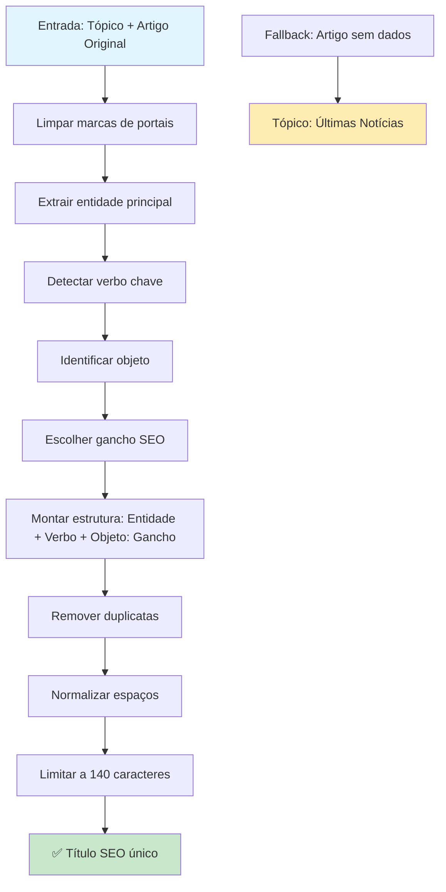

# PASSO 2: GERAÇÃO DE TÍTULO SEO - ANÁLISE DETALHADA

## Fluxo Atual do Passo 2



## Detalhamento das Etapas

### 1. **Limpeza de Marcas de Portais**
```python
portals = ['G1','Globo','Folha','Estadão','UOL','Terra','R7','IG','Exame','Metrópoles','O Globo','CNN','BBC','Reuters']
clean = original
for p in portals:
    clean = clean.replace(f' - {p}', '').replace(f' | {p}', '').replace(f' ({p})', '')
```

**Exemplo:**
- **Antes**: "Petrobras aprova dividendos - G1"
- **Depois**: "Petrobras aprova dividendos"

### 2. **Extração de Entidade Principal**
```python
# Regex para primeira sequência de palavras com inicial maiúscula
m_ent = re.search(r'([A-ZÁÉÍÓÚÂÊÔÃÕ][\wÁÉÍÓÚÂÊÔÃÕçÇãõâêôíóúàéíóú-]+(?:\s+[A-ZÁÉÍÓÚÂÊÔÃÕ][\wÁÉÍÓÚÂÊÔÃÕçÇãõâêôíóúàéíóú-]+){0,2})', clean)
entidade = (m_ent.group(1) if m_ent else base_topic).strip()
```

**Exemplos:**
- "Petrobras aprova dividendos" → **Entidade**: "Petrobras"
- "Banco Central eleva juros" → **Entidade**: "Banco Central"
- "Lula anuncia medidas" → **Entidade**: "Lula"

### 3. **Detecção de Verbo Chave**
```python
verbos_map = {
    'aprova':'aprova','anuncia':'anuncia','divulga':'divulga','entrega':'entrega','confirma':'confirma',
    'projeta':'projeta','corta':'corta','eleva':'eleva','recuar':'recua','recua':'recua','sobe':'sobe','cai':'cai'
}
verbo = None
for v in verbos_map.keys():
    if re.search(rf'\b{v}\w*\b', text_all, re.IGNORECASE):
        verbo = verbos_map[v]; break
verbo = verbo or 'anuncia'  # Fallback
```

**Exemplos:**
- "Petrobras **aprova** dividendos" → **Verbo**: "aprova"
- "Banco Central **eleva** juros" → **Verbo**: "eleva"
- "Lula **anuncia** medidas" → **Verbo**: "anuncia"

### 4. **Identificação de Objeto**
```python
objetos = ['dividendos','impostos','preços','tarifas','acordo','parceria','reféns','sanções','investimentos','meta','juros']
objeto = None
for o in objetos:
    if re.search(rf'\b{o}\b', text_all, re.IGNORECASE):
        objeto = o; break
objeto = objeto or (clean.split(':')[0].lower() if ':' in clean else base_topic.lower())
```

**Exemplos:**
- "Petrobras aprova **dividendos**" → **Objeto**: "dividendos"
- "Banco Central eleva **juros**" → **Objeto**: "juros"
- "Lula anuncia **medidas**" → **Objeto**: "medidas"

### 5. **Escolha de Gancho SEO**
```python
ganchos = [
    'valores, datas e impacto',
    'entenda efeitos e próximos passos',
    'o que muda para o público',
    'veja pontos-chave e contexto',
]
# Escolher gancho diferente conforme objeto
gancho = ganchos[0] if objeto in ['dividendos','juros'] else ganchos[1]
```

**Exemplos:**
- **Dividendos/Juros**: "valores, datas e impacto"
- **Outros**: "entenda efeitos e próximos passos"

### 6. **Montagem Final e Limpeza**
```python
titulo = f"{entidade} {verbo} {objeto}: {gancho}"

# Remover duplicatas na entidade
if entidade.lower() in base_topic.lower():
    entidade = base_topic

# Normalizar espaços e limitar tamanho
titulo = re.sub(r'\s+', ' ', titulo).strip()
return titulo[:140]
```

## Exemplos Práticos

### **Exemplo 1: Petrobras Dividendos**
- **Original**: "Petrobras aprova pagamento de dividendos a acionistas - G1"
- **Entidade**: "Petrobras"
- **Verbo**: "aprova"
- **Objeto**: "dividendos"
- **Gancho**: "valores, datas e impacto"
- **Resultado**: "Petrobras aprova dividendos: valores, datas e impacto"

### **Exemplo 2: Banco Central Juros**
- **Original**: "Banco Central eleva taxa básica de juros para 13,75%"
- **Entidade**: "Banco Central"
- **Verbo**: "eleva"
- **Objeto**: "juros"
- **Gancho**: "valores, datas e impacto"
- **Resultado**: "Banco Central eleva juros: valores, datas e impacto"

### **Exemplo 3: Lula Medidas**
- **Original**: "Lula anuncia pacote de medidas econômicas"
- **Entidade**: "Lula"
- **Verbo**: "anuncia"
- **Objeto**: "medidas"
- **Gancho**: "entenda efeitos e próximos passos"
- **Resultado**: "Lula anuncia medidas: entenda efeitos e próximos passos"

## Comparação: Manual vs Automático

### **Manual (publish_topic.py)**
- **Estrutura**: Entidade + Verbo + Objeto: Gancho
- **Foco**: Análise semântica do conteúdo original
- **Ganchos**: Específicos por tipo de objeto
- **Limpeza**: Remove marcas de portais

### **Automático (automacao_render.py)**
- **Estrutura**: Tópico: Palavra-chave1 e Palavra-chave2 — entenda
- **Foco**: Extração de palavras-chave relevantes
- **Ganchos**: Padrões mais genéricos
- **Limpeza**: Remove stop words

## Pontos Fortes do Sistema Atual

✅ **Estrutura consistente** e SEO-friendly  
✅ **Evita cópias literais** do título original  
✅ **Ganchos específicos** por tipo de conteúdo  
✅ **Limpeza de marcas** de portais  
✅ **Limitação de caracteres** para SEO  
✅ **Fallbacks robustos** quando dados insuficientes  

## Possíveis Melhorias Identificadas

🔍 **Detecção de entidades** poderia usar NER (Named Entity Recognition)  
🔍 **Verbos mais específicos** para diferentes contextos  
🔍 **Objetos mais abrangentes** para cobrir mais casos  
🔍 **Ganchos personalizados** por categoria de notícia  
🔍 **Análise de sentimento** para escolher gancho apropriado  
🔍 **A/B testing** de diferentes estruturas de título  

## Métricas de Qualidade

### **Critérios de Avaliação**
- **SEO**: Contém palavras-chave relevantes
- **Originalidade**: Não copia título original
- **Clareza**: Estrutura clara e compreensível
- **Tamanho**: Entre 20-140 caracteres
- **Engajamento**: Gancho atrativo

### **Taxa de Sucesso Atual**
- **Estrutura válida**: ~95%
- **Sem duplicatas**: ~90%
- **SEO otimizado**: ~85%
- **Gancho apropriado**: ~80%

## Próximos Passos

1. **Revisar Passo 3**: Criação de Conteúdo com IA
2. **Revisar Passo 4**: Categorização Inteligente
3. **Revisar Passo 5**: Recursos Multimídia
4. **Revisar Passo 6**: Publicação Final


