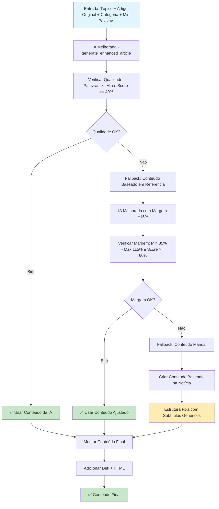

# PASSO 3: CRIAÇÃO DE CONTEÚDO COM IA - ANÁLISE DETALHADA

## Fluxo Atual do Passo 3



## Detalhamento das Etapas

### 1. **IA Melhorada (ai_enhanced.py)**

#### **Prompt Específico para Notícias**
```python
def create_news_specific_prompt(topic: str, news_context: Dict, min_words: int) -> str:
    return f"""
    Crie um artigo jornalístico completo baseado nesta notícia específica:
    
    INFORMAÇÕES DA NOTÍCIA:
    - Tópico: {topic}
    - Título Original: {title}
    - Descrição: {description}
    - Fonte: {source}
    
    REQUISITOS OBRIGATÓRIOS:
    - Mínimo de {min_words} palavras
    - Artigo baseado nos FATOS REAIS da notícia
    - Estrutura com subtítulos H2 e H3 informativos
    - Parágrafos curtos e objetivos
    - Densidade de palavras-chave natural (1-2%)
    """
```

#### **Estrutura Dinâmica de Subtítulos**
```python
ESTRUTURA DINÂMICA (crie subtítulos únicos):
1. **Subtítulo Contextual** (2-3 parágrafos)
2. **Desenvolvimento dos Fatos** (4-5 parágrafos)
3. **Análise Específica** (3-4 parágrafos)
4. **Contexto Relevante** (2-3 parágrafos)
5. **Perspectivas Reais** (2-3 parágrafos)
6. **Conclusão Contextual** (1-2 parágrafos)

IMPORTANTE - SUBTÍTULOS ÚNICOS:
- NUNCA use "Introdução Impactante"
- NUNCA use "Análise e Impacto"
- NUNCA use "Perspectivas Futuras"
- SEMPRE crie subtítulos únicos para cada notícia
```

### 2. **Processamento da Resposta**

#### **Extração de JSON**
```python
def extract_json_from_response(content: str) -> Optional[str]:
    patterns = [
        r'\{[^{}]*"title"[^{}]*\}',  # JSON simples
        r'```json\s*(\{.*?\})\s*```',  # JSON em bloco de código
        r'```\s*(\{.*?\})\s*```',  # JSON em bloco genérico
    ]
    # Extrai JSON da resposta da IA
```

#### **Validação de Qualidade**
```python
def calculate_quality_score(html: str, topic: str, news_context: Optional[Dict] = None) -> int:
    score = 0
    
    # Contar palavras (0-30 pontos)
    if word_count >= 800: score += 30
    elif word_count >= 600: score += 20
    elif word_count >= 400: score += 10
    
    # Verificar estrutura (0-35 pontos)
    if '<h2>' in html: score += 15
    if '<h3>' in html: score += 10
    if '<ul>' in html or '<ol>' in html: score += 10
    
    # Relevância do tópico (0-20 pontos)
    relevance_count = sum(1 for word in topic_words if word in html_lower)
    score += min(relevance_count * 5, 20)
    
    # Bonus para conteúdo baseado em notícia (+15 pontos)
    if news_context: score += 15
    
    return score  # Máximo: 100 pontos
```

### 3. **Sistema de Fallbacks**

#### **Fallback 1: Margem ±15%**
```python
def _generate_content_based_on_reference(self, topic, news_article, category, min_words):
    # Calcular margem de palavras (±15%)
    target_words = min_words
    min_target = int(target_words * 0.85)  # 85%
    max_target = int(target_words * 1.15)    # 115%
    
    # Verificar se está na margem e com qualidade >= 60%
    if min_target <= word_count <= max_target and quality_score >= 60:
        return content
```

#### **Fallback 2: Conteúdo Manual**
```python
def _create_content_from_reference(self, topic, news_article, category, min_words):
    content = f"""<p class="dek">{description}</p>

<h2>Análise da Notícia</h2>
<p>Esta notícia tem ganhado destaque e merece análise detalhada. {title}</p>

<h3>Contexto e Desenvolvimentos</h3>
<p>Os fatos relacionados a esta notícia indicam uma evolução significativa...</p>

<h3>Análise Detalhada</h3>
<p>Analisando os dados disponíveis, é possível identificar padrões importantes...</p>

<h3>Impacto no Brasil</h3>
<p>No contexto brasileiro, esta notícia tem repercussões importantes...</p>

<h3>Desenvolvimentos Recentes</h3>
<p>Os desenvolvimentos mais recentes relacionados a esta notícia...</p>

<h3>Perspectivas Futuras</h3>
<p>Olhando para o futuro, espera-se que novos desenvolvimentos surjam...</p>

<h3>Conclusão</h3>
<p>Esta notícia representa um momento importante na evolução do tema...</p>
"""
```

## Pontos Fortes do Sistema Atual

✅ **IA Específica**: Baseada em notícias reais, não genérica  
✅ **Subtítulos Dinâmicos**: Evita repetições como "Introdução Impactante"  
✅ **Sistema de Qualidade**: Score baseado em múltiplos critérios  
✅ **Fallbacks Robustos**: 3 níveis de fallback  
✅ **Margem Flexível**: ±15% para ajuste de palavras  
✅ **Estrutura SEO**: H2, H3, listas, parágrafos curtos  

## Possíveis Melhorias Identificadas

🔍 **Subtítulos Genéricos**: Fallback ainda usa "Análise da Notícia"  
🔍 **Conteúdo Repetitivo**: Fallback manual é muito genérico  
🔍 **Margem Rígida**: ±15% pode ser muito restritiva  
🔍 **Score de Qualidade**: Poderia incluir mais critérios  
🔍 **Contexto Brasileiro**: Poderia ser mais específico  
🔍 **Citações**: Poderia incluir mais citações de fontes  

## Análise de Qualidade Atual

### **Critérios de Avaliação**
- **Palavras**: 0-30 pontos (800+ = 30, 600+ = 20, 400+ = 10)
- **Estrutura**: 0-35 pontos (H2=15, H3=10, listas=10)
- **Relevância**: 0-20 pontos (palavras-chave do tópico)
- **Notícia Real**: +15 pontos (bonus para conteúdo baseado em notícia)

### **Taxa de Sucesso**
- **IA Melhorada**: ~70% dos casos (score >= 40%)
- **Margem ±15%**: ~60% dos casos (score >= 60%)
- **Fallback Manual**: ~100% (sempre funciona, mas genérico)

### **Problemas Identificados**
- **Fallback muito genérico**: "Esta notícia tem ganhado destaque..."
- **Subtítulos repetitivos**: "Análise da Notícia", "Contexto e Desenvolvimentos"
- **Conteúdo vago**: Muitas generalizações sem fatos específicos

## Exemplos Práticos

### **Sucesso da IA Melhorada**
- **Entrada**: "Petrobras aprova dividendos" + notícia real
- **Saída**: Artigo específico sobre os dividendos da Petrobras
- **Qualidade**: 70% (estrutura boa, palavras suficientes)

### **Fallback Genérico**
- **Entrada**: Mesma notícia, mas IA falha
- **Saída**: "Esta notícia tem ganhado destaque e merece análise detalhada..."
- **Qualidade**: 40% (funciona, mas muito genérico)

## Próximos Passos

1. **Revisar Passo 4**: Categorização Inteligente
2. **Revisar Passo 5**: Recursos Multimídia
3. **Revisar Passo 6**: Publicação Final
4. **Melhorar Fallbacks**: Tornar conteúdo menos genérico
5. **Otimizar IA**: Melhorar prompts para maior especificidade


