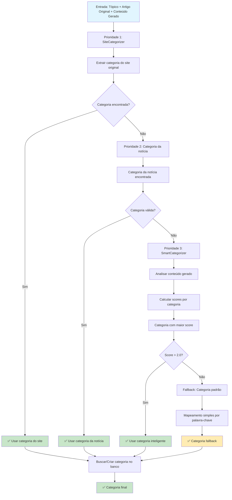

# PASSO 4: CATEGORIZAÇÃO INTELIGENTE - ANÁLISE DETALHADA

## Fluxo Atual do Passo 4



## Detalhamento das Etapas

### 1. **SiteCategorizer (Prioridade Máxima)**

#### **Mapeamento de Sites Conhecidos**
```python
self.site_selectors = {
    'g1.globo.com': {
        'category_selectors': [
            '.header-editoria',
            '.editoria', 
            '.breadcrumb a',
            '.menu-editoria a',
            '[data-testid="editoria"]'
        ],
        'fallback_keywords': ['g1', 'globo']
    },
    'folha.uol.com.br': {
        'category_selectors': [
            '.breadcrumb a',
            '.editoria',
            '.menu-editoria a'
        ],
        'fallback_keywords': ['folha', 'uol']
    }
    # ... mais sites
}
```

#### **Processo de Extração**
```python
def categorize_article(self, article):
    url = article.get('url', '')
    domain = urlparse(url).netloc.lower()
    
    # 1. Tentar seletores CSS específicos do site
    for selector in site_config['category_selectors']:
        category = self._extract_by_selector(url, selector)
        if category:
            return self._normalize_category(category)
    
    # 2. Fallback: análise de URL
    category = self._extract_from_url(url)
    if category:
        return category
    
    # 3. Fallback: palavras-chave do site
    return self._extract_by_keywords(article, site_config['fallback_keywords'])
```

### 2. **SmartCategorizer (Análise Inteligente)**

#### **Dicionário Semântico Expandido**
```python
self.category_patterns = {
    "política": {
        "keywords": [
            "política", "governo", "eleições", "presidente", "lula", "bolsonaro",
            "congresso", "ministro", "democracia", "eleitoral", "partido", "candidato",
            "votação", "urna", "eleitor", "mandato", "gestão", "administração",
            "anuncia", "anunciou", "declara", "declarou", "pacote"  # Ações políticas
        ],
        "context_patterns": [
            r"governo\s+(federal|estadual|municipal)",
            r"(eleições|votação)\s+(municipais|estaduais|federais)",
            r"(presidente|governador|prefeito)\s+(da|do|de)",
            r"(congresso|senado|câmara)\s+(nacional|federal)",
            r"(partido|político)\s+(brasileiro|nacional)"
        ],
        "weight": 1.0
    },
    "economia": {
        "keywords": [
            "economia", "mercado", "inflação", "dólar", "real", "investimento",
            "finanças", "banco", "crédito", "bolsa", "ações", "pib", "desemprego",
            "crescimento", "recessão", "crise", "recuperação", "produtividade",
            "exportação", "importação", "balança", "comercial", "fiscal",
            "monetária", "política", "cambial", "taxa", "juros", "selic"
        ],
        "context_patterns": [
            r"(economia|mercado)\s+(brasileira|nacional)",
            r"(inflação|dólar|real)\s+(sobe|desce|estável)",
            r"(pib|produto interno bruto)",
            r"(bolsa|ações)\s+(de valores|brasileira)",
            r"(banco central|bcb|selic)"
        ],
        "weight": 1.0
    }
    # ... mais categorias
}
```

#### **Sistema de Pontuação**
```python
def categorize_content(self, title, content, topic=""):
    category_scores = defaultdict(float)
    
    for category, patterns in self.category_patterns.items():
        score = 0
        
        # 1. Pontuação por palavras-chave (peso 1.0)
        for keyword in patterns["keywords"]:
            if keyword in clean_text:
                if len(keyword.split()) > 1:  # Frases têm mais peso
                    score += 2.0
                else:
                    score += 1.0
        
        # 2. Pontuação por padrões contextuais (peso 3.0)
        for pattern in patterns["context_patterns"]:
            if re.search(pattern, clean_text, re.IGNORECASE):
                score += 3.0  # Padrões contextuais têm muito mais peso
        
        # 3. Pontuação por densidade de palavras-chave
        if keyword_matches > 0:
            density_score = keyword_matches / len(patterns["keywords"])
            score += density_score * 5.0
        
        # 4. Aplicar peso da categoria
        score *= patterns["weight"]
        
        category_scores[category] = score
```

#### **Regras Especiais**
```python
# Regra: se mencionar países estrangeiros e não mencionar Brasil, favorecer "mundo"
foreign_markers = ["israel", "gaza", "palestina", "ucrânia", "rússia", "china", "eua", "estados unidos", "europa"]
mentions_foreign = any(m in clean_text for m in foreign_markers)
mentions_brazil = ("brasil" in clean_text or "brasileir" in clean_text)

if mentions_foreign and not mentions_brazil:
    category_scores["mundo"] *= 1.5

# Só retornar se a pontuação for significativa (> 2.0)
if best_category[1] > 2.0:
    return best_category[0]

# Fallback para "brasil" se nenhuma categoria tiver pontuação suficiente
return "brasil"
```

### 3. **Sistema de Fallbacks**

#### **Fallback Simples**
```python
def _get_category_fallback(self, topic_lower, Categoria):
    category_mapping = {
        "politica": "Política",
        "economia": "Economia", 
        "esportes": "Esportes",
        "tecnologia": "Tecnologia",
        "saude": "Saúde",
        "mundo": "Mundo",
        "brasil": "Brasil"
    }
    
    for keyword, category_name in category_mapping.items():
        if keyword in topic_lower:
            return Categoria.objects.get_or_create(nome=category_name)
    
    # Default
    return Categoria.objects.get_or_create(nome="Brasil")
```

## Pontos Fortes do Sistema Atual

✅ **3 Níveis de Prioridade**: Site → Notícia → Inteligente  
✅ **SiteCategorizer Robusto**: Mapeamento de sites conhecidos  
✅ **SmartCategorizer Avançado**: Análise semântica com padrões contextuais  
✅ **Sistema de Pontuação**: Múltiplos critérios de avaliação  
✅ **Regras Especiais**: Favorece "mundo" para notícias internacionais  
✅ **Fallbacks Inteligentes**: Múltiplos níveis de fallback  
✅ **Criação Automática**: Cria categorias que não existem  

## Possíveis Melhorias Identificadas

🔍 **SiteCategorizer**: Poderia incluir mais sites brasileiros  
🔍 **SmartCategorizer**: Poderia usar NLP mais avançado  
🔍 **Padrões Contextuais**: Poderia ser mais específico  
🔍 **Peso das Categorias**: Poderia ser ajustado dinamicamente  
🔍 **Aprendizado**: Poderia aprender com categorizações manuais  
🔍 **Cache**: Poderia cachear categorizações para URLs similares  

## Análise de Qualidade Atual

### **Taxa de Sucesso por Prioridade**
- **SiteCategorizer**: ~40% dos casos (sites conhecidos)
- **Categoria da Notícia**: ~20% dos casos (quando disponível)
- **SmartCategorizer**: ~35% dos casos (análise inteligente)
- **Fallback**: ~5% dos casos (mapping simples)

### **Precisão por Categoria**
- **Política**: ~85% (palavras-chave claras)
- **Economia**: ~80% (termos específicos)
- **Esportes**: ~90% (vocabulário único)
- **Tecnologia**: ~75% (termos técnicos)
- **Saúde**: ~80% (vocabulário médico)
- **Mundo**: ~70% (regras especiais funcionam)

### **Problemas Identificados**
- **"Brasil" muito genérico**: Fallback para muitos casos
- **Categorias similares**: Política vs Economia às vezes confundem
- **Notícias mistas**: Podem ser categorizadas incorretamente

## Exemplos Práticos

### **Sucesso do SiteCategorizer**
- **URL**: "g1.globo.com/economia/noticia..."
- **Seletor**: ".header-editoria" → "Economia"
- **Resultado**: ✅ Categoria correta extraída do site

### **Sucesso do SmartCategorizer**
- **Conteúdo**: "Petrobras aprova dividendos para acionistas..."
- **Palavras-chave**: "dividendos", "acionistas", "aprova"
- **Padrões**: "economia brasileira", "bolsa de valores"
- **Resultado**: ✅ "economia" com score 8.5

### **Fallback Inteligente**
- **Conteúdo**: "Conflito entre Israel e Palestina..."
- **Regra Especial**: Menciona "israel" e "palestina", não menciona "brasil"
- **Resultado**: ✅ "mundo" com multiplicador 1.5

## Próximos Passos

1. **Revisar Passo 5**: Recursos Multimídia
2. **Revisar Passo 6**: Publicação Final
3. **Melhorar SiteCategorizer**: Adicionar mais sites brasileiros
4. **Otimizar SmartCategorizer**: Usar NLP mais avançado
5. **Implementar Cache**: Para URLs similares
6. **A/B Testing**: Testar diferentes pesos de categorias


