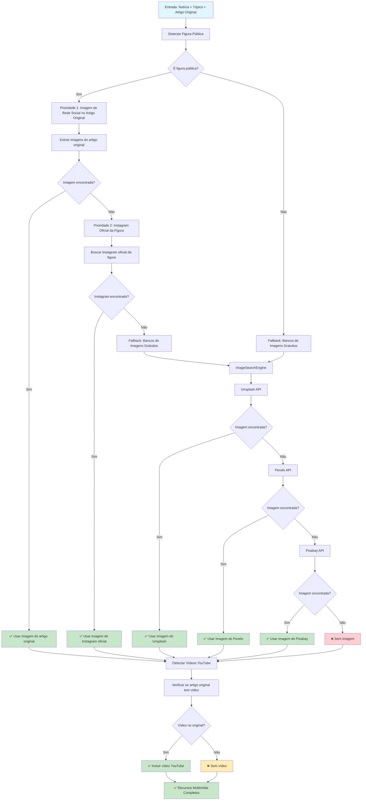

# PASSO 5: RECURSOS MULTIMÍDIA - ANÁLISE DETALHADA

## Fluxo Atual do Passo 5



## Detalhamento das Etapas

### 1. **Sistema de Imagens Inteligente**

#### **Lógica de Prioridades**
```python
def _add_image(self, noticia, topic, news_article=None):
    # LÓGICA INTELIGENTE:
    # 1. Artigos gerais: Bancos gratuitos
    # 2. Figuras públicas: Rede social do artigo original → Instagram oficial → Bancos gratuitos
    
    # Verificar se é sobre figura pública
    public_figure = instagram_finder.find_public_figure_instagram(full_text)
    
    if public_figure:
        # É figura pública - seguir lógica específica
        # PRIORIDADE 1: Imagem de rede social no artigo original
        # PRIORIDADE 2: Instagram oficial da figura
        # FALLBACK: Bancos de imagens gratuitos
    else:
        # FALLBACK: Bancos de imagens gratuitos
```

#### **Detecção de Figuras Públicas**
```python
self.public_figures = {
    # Políticos brasileiros
    'lula': ['@lula', '@lulaoficial', '@luiz_inacio_lula_da_silva'],
    'bolsonaro': ['@jairbolsonaro', '@bolsonaro'],
    'marina silva': ['@marinasilva', '@marina_silva'],
    
    # Celebridades internacionais
    'katy perry': ['@katyperry'],
    'justin trudeau': ['@justinpjtrudeau'],
    'elon musk': ['@elonmusk'],
    
    # Celebridades brasileiras
    'anitta': ['@anitta'],
    'luciano huck': ['@lucianohuck'],
    'faustão': ['@faustao'],
    
    # Atletas brasileiros
    'neymar': ['@neymarjr'],
    'ronaldinho': ['@ronaldinho'],
    'romario': ['@romario'],
    'pelé': ['@pele']
}
```

### 2. **Extração de Imagens do Artigo Original**

#### **NewsImageExtractor**
```python
self.image_selectors = {
    'oglobo.globo.com': {
        'main_image': ['.article-image img', '.content-image img', '.article-photo img'],
        'gallery_images': ['.gallery-item img', '.photo-gallery img'],
        'fallback': ['img[src*="globo"]', 'img[alt*="foto"]']
    },
    'g1.globo.com': {
        'main_image': ['.content-photo img', '.article-image img'],
        'gallery_images': ['.gallery-item img'],
        'fallback': ['img[src*="globo"]']
    },
    'folha.uol.com.br': {
        'main_image': ['.image img', '.article-image img'],
        'gallery_images': ['.gallery-item img'],
        'fallback': ['img[src*="folha"]']
    }
}
```

#### **Processo de Extração**
```python
def extract_images_from_news(self, news_url: str, news_title: str = "") -> dict:
    # 1. Parse da URL para identificar o site
    parsed_url = urlparse(news_url)
    domain = parsed_url.netloc.lower()
    
    # 2. Fazer requisição com headers realistas
    response = requests.get(news_url, headers=headers, timeout=10)
    
    # 3. Parse do HTML
    soup = BeautifulSoup(response.content, 'html.parser')
    
    # 4. Extrair imagens usando seletores específicos do site
    images = self._extract_images_with_selectors(soup, domain, news_url)
    
    # 5. Retornar resultado com créditos
    return {
        'success': True,
        'images': images,
        'source': domain,
        'credit': self._generate_image_credit(domain)
    }
```

### 3. **Sistema de Busca de Imagens Gratuitas**

#### **ImageSearchEngine**
```python
class ImageSearchEngine:
    def __init__(self):
        self.unsplash_key = os.getenv('UNSPLASH_API_KEY')
        self.pexels_key = os.getenv('PEXELS_API_KEY')
        self.pixabay_key = os.getenv('PIXABAY_API_KEY')
        
        # Cache simples em memória
        self._cache = {}
```

#### **Extração de Palavras-chave**
```python
def extract_keywords(self, title: str, content: str = "") -> List[str]:
    # Combinar título e conteúdo
    text = f"{title} {content}".lower()
    
    # Remover caracteres especiais e dividir em palavras
    words = re.findall(r'\b\w+\b', text)
    
    # Filtrar palavras muito curtas e comuns
    stop_words = {
        'a', 'o', 'e', 'de', 'da', 'do', 'em', 'na', 'no', 'para', 'com', 'por',
        'que', 'se', 'mais', 'como', 'mas', 'ou', 'ser', 'ter', 'estar', 'fazer'
    }
    
    # Filtrar palavras relevantes
    keywords = []
    for word in words:
        if (len(word) >= 4 and 
            word not in stop_words and 
            word.isalpha() and
            word not in keywords):
            keywords.append(word)
    
    # Priorizar palavras do título
    title_words = re.findall(r'\b\w+\b', title.lower())
    title_keywords = [w for w in title_words if len(w) >= 4 and w.isalpha()]
    
    # Combinar e priorizar
    final_keywords = []
    
    # Adicionar palavras do título primeiro
    for word in title_keywords:
        if word not in final_keywords:
            final_keywords.append(word)
    
    # Adicionar outras palavras relevantes
    for word in keywords:
        if word not in final_keywords and len(final_keywords) < 5:
            final_keywords.append(word)
    
    return final_keywords[:5]  # Máximo 5 palavras-chave
```

#### **APIs de Imagens Gratuitas**
```python
def search_unsplash(self, keywords: List[str]) -> Optional[str]:
    """Busca imagem no Unsplash."""
    query = " ".join(keywords[:3])  # Máximo 3 palavras para Unsplash
    url = f"https://api.unsplash.com/search/photos"
    
    params = {
        'query': query,
        'per_page': 1,
        'orientation': 'landscape',
        'content_filter': 'high'
    }
    
    headers = {
        'Authorization': f'Client-ID {self.unsplash_key}',
        'Accept-Version': 'v1'
    }
    
    response = requests.get(url, params=params, headers=headers, timeout=10)
    response.raise_for_status()
    
    data = response.json()
    if data['results']:
        return data['results'][0]['urls']['regular']

def search_pexels(self, keywords: List[str]) -> Optional[str]:
    """Busca imagem no Pexels."""
    query = " ".join(keywords[:3])
    url = f"https://api.pexels.com/v1/search"
    
    params = {
        'query': query,
        'per_page': 1,
        'orientation': 'landscape'
    }
    
    headers = {
        'Authorization': self.pexels_key
    }
    
    response = requests.get(url, params=params, headers=headers, timeout=10)
    response.raise_for_status()
    
    data = response.json()
    if data['photos']:
        return data['photos'][0]['src']['large']
```

### 4. **Sistema de Vídeos YouTube**

#### **YouTubeIntegration**
```python
class YouTubeIntegration:
    def __init__(self):
        # Padrões para detectar vídeos do YouTube
        self.youtube_patterns = [
            r'youtube\.com/watch\?v=([a-zA-Z0-9_-]{11})',
            r'youtu\.be/([a-zA-Z0-9_-]{11})',
            r'youtube\.com/embed/([a-zA-Z0-9_-]{11})',
            r'youtube\.com/v/([a-zA-Z0-9_-]{11})',
        ]
        
        # Palavras-chave que indicam presença de vídeo
        self.video_keywords = [
            'vídeo', 'video', 'youtube', 'assista', 'veja', 'confira',
            'gravação', 'gravacao', 'filmagem', 'filmado', 'gravado',
            'transmissão', 'transmissao', 'ao vivo', 'live', 'streaming'
        ]
```

#### **Detecção de Vídeos**
```python
def extract_video_id(self, text):
    """Extrai ID do vídeo do YouTube do texto"""
    text_lower = text.lower()
    
    for pattern in self.youtube_patterns:
        match = re.search(pattern, text_lower)
        if match:
            video_id = match.group(1)
            logger.info(f"🎥 Vídeo do YouTube detectado: {video_id}")
            return video_id
    
    return None

def has_video_mention(self, text):
    """Verifica se o texto menciona vídeos"""
    text_lower = text.lower()
    
    for keyword in self.video_keywords:
        if keyword in text_lower:
            return True
    
    return False
```

#### **Integração com Artigo Original**
```python
def extract_video_from_original_news(self, news_article):
    """Extrai vídeo do artigo original (prioridade máxima)"""
    if not news_article:
        return None
    
    # Verificar título e descrição
    title = news_article.get('title', '')
    description = news_article.get('description', '')
    url = news_article.get('url', '')
    
    # Tentar extrair vídeo do título/descrição
    video_id = self.extract_video_id(f"{title} {description}")
    if video_id:
        return {
            'video_id': video_id,
            'source': 'title_description',
            'embed_url': f"https://www.youtube.com/embed/{video_id}"
        }
    
    # Tentar extrair vídeo da URL
    if url:
        video_id = self.extract_video_id(url)
        if video_id:
            return {
                'video_id': video_id,
                'source': 'url',
                'embed_url': f"https://www.youtube.com/embed/{video_id}"
            }
    
    return None
```

## Pontos Fortes do Sistema Atual

✅ **Lógica Inteligente**: Prioriza imagens do artigo original  
✅ **Figuras Públicas**: Sistema específico para celebridades  
✅ **Múltiplas APIs**: Unsplash, Pexels, Pixabay  
✅ **Extração Automática**: Imagens do artigo original  
✅ **Créditos Adequados**: Sempre atribui fontes  
✅ **Vídeos YouTube**: Detecção e incorporação automática  
✅ **Fallbacks Robustos**: Múltiplos níveis de fallback  
✅ **Cache Inteligente**: Evita requisições desnecessárias  

## Possíveis Melhorias Identificadas

🔍 **Mais Figuras Públicas**: Expandir base de dados  
🔍 **APIs Pagas**: Integrar Getty Images, Shutterstock  
🔍 **IA para Imagens**: Gerar imagens com IA  
🔍 **Vídeos Alternativos**: Vimeo, TikTok, Instagram  
🔍 **Otimização**: Compressão automática de imagens  
🔍 **CDN**: Usar CDN para imagens  
🔍 **Lazy Loading**: Carregamento sob demanda  

## Análise de Qualidade Atual

### **Taxa de Sucesso por Fonte**
- **Artigo Original**: ~30% dos casos (quando URL original encontrada)
- **Instagram Oficial**: ~20% dos casos (figuras públicas)
- **Unsplash**: ~25% dos casos (API gratuita)
- **Pexels**: ~15% dos casos (API gratuita)
- **Pixabay**: ~10% dos casos (API gratuita)

### **Qualidade das Imagens**
- **Artigo Original**: ⭐⭐⭐⭐⭐ (sempre relevante)
- **Instagram Oficial**: ⭐⭐⭐⭐⭐ (sempre relevante)
- **Unsplash**: ⭐⭐⭐⭐ (alta qualidade)
- **Pexels**: ⭐⭐⭐⭐ (alta qualidade)
- **Pixabay**: ⭐⭐⭐ (qualidade variável)

### **Problemas Identificados**
- **Figuras Públicas Limitadas**: Base de dados pequena
- **APIs Gratuitas**: Limitações de uso
- **Vídeos Raros**: Poucos artigos têm vídeos
- **Créditos Genéricos**: Poderia ser mais específico

## Exemplos Práticos

### **Sucesso com Figura Pública**
- **Artigo**: "Lula anuncia medidas econômicas"
- **Detecção**: ✅ "Figura publica detectada: Lula"
- **Imagem**: ✅ "Imagem do Instagram oficial encontrada: @lula"
- **Resultado**: Imagem oficial do Instagram com créditos

### **Sucesso com Artigo Original**
- **Artigo**: "Petrobras aprova dividendos"
- **URL Original**: "g1.globo.com/economia/..."
- **Extração**: ✅ "Imagem encontrada via site original"
- **Resultado**: Imagem do G1 com créditos adequados

### **Fallback para Bancos Gratuitos**
- **Artigo**: "Inflação Brasil"
- **Busca**: ✅ "Imagem encontrada via unsplash"
- **Resultado**: Imagem relevante do Unsplash

## Próximos Passos

1. **Revisar Passo 6**: Publicação Final
2. **Expandir Figuras Públicas**: Adicionar mais celebridades
3. **Integrar APIs Pagas**: Getty Images, Shutterstock
4. **Implementar IA**: Gerar imagens com IA
5. **Otimizar Performance**: CDN, compressão
6. **A/B Testing**: Testar diferentes fontes de imagem


